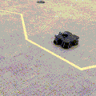
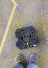
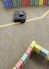

# Warmup Project

## Drive in a Square

I used a timing approach for this problem. The `DriveSquare` class creates
two `cmd_vel` commands: one that makes the robot drive forward in a straight
line, and one that makes the robot turn in place. The class' main loop keeps
a counter that ticks up every time the `Rate` object causes the loop to be 
run. Using this counter, the loop repeatedly sends turning commands for about
3.5 seconds, then forward commands for about 5 seconds.

### Drive in a Square gif

## Person Follower

For this problem, I used proportional control for both the turning speed and
linear speed. The angle and distance to the closest object are found by
taking the laser scan from the robot and averaging each range with 5
adjacent ranges on either side in order to reduce noise. The target value for
the rotational proportional control is having the closest object be directly
ahead, and the target value for the linear proportional control is being a 
certain distance from the closest object. The robot only moves forward if the
closest object is within 45 degrees from straight ahead, otherwise it turns
in place.

For this problem and the Wall Follower, I wrote a function
`cap_magnitude`, which takes two arguments `x` and `max_magnitude` and
returns `x` if its magnitude is less `max_magnitude`, otherwise it returns 
either `max_magnitude` or `-max_magnitdude` matching the sign of `x`.

### Person Follower gif

## Wall Follower

I also used proportional control for this problem. If the closest object is 
within a certain angle range from directly left, the robot moves foward and
adjusts its angle to the wall using a measurement of the derivative of the
distance to the wall: if the robot is getting closer the wall it turns right,
and if the robot is getting farther from the wall it turns left. If the
closest object is not close to directly left, the robot turns in place in
whichever direction will take it to the left side faster. If there are no
objects near the robot, for example if it is in the middle of an empty room,
it moves forward.

### Wall Follower gif

## Challenges

It was difficult making the wall follower follow curved walls and go around
open corners smoothly without jittering too much. To solve this problem I 
ultimately settled on a derivative-based proportional controller that
takes the average over 10 previous measurements to reduce noise.

## Future Work

If I had more time, I would change the person follower to not always follow
the closest object but instead have some basic idea of how a person behaves. 
This could be done using the camera instead or in addition to the laser scan. 
I would also add a term to the proportional control in the wall follower to
take into account the absolute distance to the wall relative to some target
distance, rather than only the change in distance.

## Takeaways

### Using proportional control

Proportional control is a useful tool for making the robot smoothly approach
some target state in a variety of initial states. It can simultaneously be
used for different aspects of control like turning speed and linear speed.

### Using several different modes of operation

When implementing complex behaviors, it is helpful to split the behavior into
several different modes, which are chosen from based on outside observations
or some internal state. For example, my wall follower implementation has
different behaviors depending on if the closest object is on the left, not
on the left, or if there is no close object at all.
